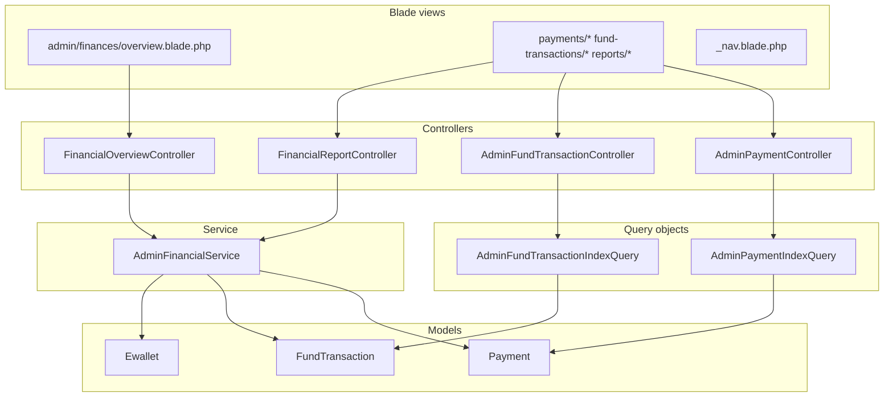

# Admin Finance Management & Payment Monitoring

This document describes the **admin finance module**: what it does, how it is structured, and the **design decisions** that make future changes predictable. It complements domain docs such as [`SYSTEM_WALLET_DONATION_FLOW.md`](./SYSTEM_WALLET_DONATION_FLOW.md) and [`PAYMENT_REFERENCE.md`](./PAYMENT_REFERENCE.md).

---

## Feature summary (conventional commit style)

```
feat(admin-finance): add admin finance management and payment monitoring module

- add admin finance overview dashboard with key financial metrics
- add admin payments monitoring pages with filters and details view
- add admin fund ledger pages with filters and transaction details
- add finance reports page with date-based summaries
- add CSV export for payments and fund transactions
- add finance navigation section to admin sidebar
- reuse existing Payment, FundTransaction, Ewallet, and RequestPaymentLink models
- keep balances based on ewallets.balance and FundTransactionObserver
- preserve current payment and ledger business logic without introducing a parallel finance system
- add admin financial queries, controllers, views, and service layer support
- add tests for admin finance access, monitoring, reporting, and failed payment behavior
```

---

## Core principle: observation, not duplication

| Decision | Rationale |
|----------|-----------|
| **No parallel finance subsystem** | All numbers come from existing models (`Payment`, `FundTransaction`, `Ewallet`). Admin UI is read-only monitoring unless you explicitly add write paths elsewhere. |
| **Ledger truth** | `FundTransaction` rows represent internal money movement; `Ewallet::balance` for the system wallet is maintained by **`FundTransactionObserver`** (and related flows). Admin aggregates that reference “system wallet” use the `SYSTEM` ewallet. |
| **Gateway truth** | `Payment` rows represent MyFatoorah (and future gateway) lifecycle; statuses and amounts are whatever the gateway pipeline recorded. |

**Implication for developers:** Changing how money moves in the app (observers, payment success handlers) automatically affects admin figures. Changing admin Blade templates does **not** change money—only presentation.

---

## URL map & route names

All routes live under **`auth` + `account.approved` + `role:admin`**, prefix **`/admin`**, name prefix **`admin.`**.

| Path | Route name | Controller |
|------|------------|------------|
| `GET /admin/finances` | `admin.finances.overview` | `FinancialOverviewController@index` |
| `GET /admin/finances/payments` | `admin.finances.payments.index` | `AdminPaymentController@index` |
| `GET /admin/finances/payments/export` | `admin.finances.payments.export` | `AdminPaymentController@export` |
| `GET /admin/finances/payments/{payment}` | `admin.finances.payments.show` | `AdminPaymentController@show` |
| `GET /admin/finances/fund-transactions` | `admin.finances.fund-transactions.index` | `AdminFundTransactionController@index` |
| `GET /admin/finances/fund-transactions/export` | `admin.finances.fund-transactions.export` | `AdminFundTransactionController@export` |
| `GET /admin/finances/fund-transactions/{fund_transaction}` | `admin.finances.fund-transactions.show` | `AdminFundTransactionController@show` |
| `GET /admin/finances/reports` | `admin.finances.reports.index` | `FinancialReportController@index` |

**Defined in:** `routes/web.php` (group `Route::prefix('finances')->name('finances.')`).

---

## Layering (where to edit what)



| Layer | Responsibility | Safe changes |
|-------|----------------|--------------|
| **`App\Http\Services\Admin\AdminFinancialService`** | Aggregates for overview + date-range reports. | Add new aggregate methods; keep return shapes documented. Do not embed HTTP concerns. |
| **`App\Http\Queries\Admin\*`** | Filter/sort/paginate list queries; **shared** by index + CSV export via `buildQuery()`. | Add filters here so list + export stay aligned. |
| **Controllers** | HTTP, validation (reports), compose view data, stream CSV. | Thin; heavy lifting stays in service/query. |
| **`App\Support\FinanceUi`** | Labels for audit JSON keys / activity descriptions (`finance.fields.*`, `finance.audit.*`). | Add keys in `lang/en.json` & `lang/ar.json` when new audit fields appear. |
| **Blade** | Presentation, RTL-friendly layout, ApexCharts init on overview. | Copy/strings via `__('finance.*')`; avoid new business math in Blade when possible. |

---

## `AdminFinancialService` contract

### `getOverview(): array`

Single place for **global** dashboard numbers (not filtered by date).

| Key | Meaning |
|-----|---------|
| `system_wallet_balance` | `Ewallet` where `owner_type === SYSTEM` → `balance`. |
| `successful_payments_*` | `Payment` with `status === SUCCEEDED` → count + sum(amount). |
| `pending_*` | `Payment` in `INITIATED`, `PENDING`, `PROCESSING`. |
| `failed_*` | `Payment` with `status === FAILED`. |
| `fund_inbound_system` | Sum of `FundTransaction` **IN** for system wallet. |
| `fund_outbound_system` | Sum of **OUT** for system wallet. |
| `transfers_to_providers` | Subset of outbound: `source === SOURCE_PAYOUT` (payout to providers). |

**Design decision:** Pending vs failed are **separate** in the service so Payments screen and reports stay precise. The **overview UI** may combine them for display only (see below).

### `getRangeSummary(Carbon $from, Carbon $to): array`

Used by **Reports**; filters `Payment` and `FundTransaction` by `created_at` in range. Includes per-status payment breakdown via `GROUP BY status`, plus ledger IN/OUT sums for the range.

---

## Overview dashboard (`/admin/finances`) — extra decisions

| Topic | Decision | Where to change |
|-------|----------|-----------------|
| **Charts** | ApexCharts (global `window.ApexCharts` from app bundle). Config is built in **`FinancialOverviewController`** (JSON-serializable options only—no PHP closures). | `FinancialOverviewController::buildPaymentsDonutConfig`, `buildLedgerBarConfig`. |
| **RTL** | `chart.rtl: true` when `app()->getLocale() === 'ar'`. | Same methods. |
| **Donut segments** | **Presentation-only:** “unsuccessful” = `pending_amount + failed_amount` (and counts), so the donut is **Succeeded vs Unsuccessful**. Service totals unchanged. | `FinancialOverviewController@index` merges into `$overview['unsuccessful_*']`. |
| **Donut labels on slices** | Disabled (`dataLabels.enabled: false`) for readability; legend + tooltip carry values. | `buildPaymentsDonutConfig`. |
| **Intro copy** | Collapsible `<details>` / `<summary>` (“How to read this dashboard?”). | `overview.blade.php` + `finance.overview.intro_*` in JSON lang files. |
| **Copy / i18n** | All user-visible strings under `finance.*` in **`lang/en.json`** and **`lang/ar.json`** (flat keys). | Add keys there—no PHP lang files for this module. |

To **revert** to three-way donut (success / pending / failed), restore series/labels from `getOverview()` keys and adjust the Blade KPI grid—**do not** change `getOverview()` unless product wants new business definitions.

---

## Payments monitoring

- **List:** `AdminPaymentIndexQuery` — search (id, external id, donor name/email/phone), status, gateway, donor id, date range, amount range.
- **Synthetic filter `PROBLEM_GROUP`:** `whereIn` on `FAILED`, `PENDING`, `PROCESSING` (see code—**does not** include `INITIATED`). Used by overview quick action and payments filter dropdown.
- **Detail:** Loads `sponsor`, `fundTransactions.wallet`, `requestPaymentLinks.request`; shows Spatie `Activity` filtered by `properties->payment_id`.
- **Export:** Same `buildQuery()` as index, chunked CSV stream.

**Modify filters:** Edit `AdminPaymentIndexQuery::buildQuery` only; index + export stay consistent.

---

## Fund ledger (internal)

- **List:** `AdminFundTransactionIndexQuery` — search numeric id/payment_id/request_id, wallet type, direction, source, donor, provider user, request id, dates.
- **Detail:** Loads wallet/provider, sponsor, payment, request, redemption; activity resolution by `payment_id` and/or `request_id`.
- **Export:** Chunked CSV aligned with the same query builder.

---

## Reports

- **Input validation:** `period`: `daily` | `monthly` | `custom`; optional `date_from` / `date_to`.
- **Defaults:** Custom range defaults to last 30 days → today if dates omitted.
- **Data:** `AdminFinancialService::getRangeSummary` only.

---

## Sidebar

- **File:** `app/Main/SidebarPanel.php` → `admin_finances` submenu entries point to `admin.finances.overview`, `payments.index`, `fund-transactions.index`, `reports.index`.
- **Labels:** `finance.nav.*` in JSON lang files.

---

## Security

- Entire admin group uses **`role:admin`** (Spatie or project guard—same as other admin routes).
- No extra policy class is required for finance routes if admin role is sufficient; if you add fine-grained permissions later, gate the `finances` route group or individual controllers.

---

## Tests

- **File:** `tests/Feature/Admin/AdminFinancialManagementTest.php`
- Covers: admin can open overview/payments/ledger/reports; donor forbidden; overview totals; payment detail links; failed payment has no fund transaction in normal flow; reports show gateway totals in range.

**After changing aggregates or routes**, update or extend this test file.

---

## Quick reference: important files

| Area | Path |
|------|------|
| Routes | `routes/web.php` |
| Overview | `app/Http/Controllers/Admin/FinancialOverviewController.php`, `resources/views/admin/finances/overview.blade.php` |
| Payments | `app/Http/Controllers/Admin/AdminPaymentController.php`, `app/Http/Queries/Admin/AdminPaymentIndexQuery.php`, `resources/views/admin/finances/payments/*` |
| Ledger | `app/Http/Controllers/Admin/AdminFundTransactionController.php`, `app/Http/Queries/Admin/AdminFundTransactionIndexQuery.php`, `resources/views/admin/finances/fund-transactions/*` |
| Reports | `app/Http/Controllers/Admin/FinancialReportController.php`, `resources/views/admin/finances/reports/index.blade.php` |
| Aggregates | `app/Http/Services/Admin/AdminFinancialService.php` |
| Shared nav | `resources/views/admin/finances/_nav.blade.php` |
| UI helpers | `app/Support/FinanceUi.php` |
| Sidebar | `app/Main/SidebarPanel.php` |
| i18n | `lang/en.json`, `lang/ar.json` (`finance.*`) |
| Tests | `tests/Feature/Admin/AdminFinancialManagementTest.php` |

---

## Checklist before you ship finance UI changes

1. **Aggregates:** Prefer `AdminFinancialService` for new dashboard/report numbers.
2. **Lists + CSV:** Extend `buildQuery()` on the relevant query class so export matches the grid.
3. **Strings:** Add `finance.*` keys in **both** `en` and `ar` JSON.
4. **Overview charts:** Keep Apex options serializable in PHP; complex formatters belong in a small JS block if needed.
5. **Run tests:** `php artisan test --filter=AdminFinancialManagementTest`

---

## Related documentation

- [`SYSTEM_WALLET_DONATION_FLOW.md`](./SYSTEM_WALLET_DONATION_FLOW.md) — wallet and donation flow
- [`PAYMENT_REFERENCE.md`](./PAYMENT_REFERENCE.md) — payment references
- [`CHANGELOG_REQUEST_AND_WALLET.md`](./CHANGELOG_REQUEST_AND_WALLET.md) — historical wallet/request changes
